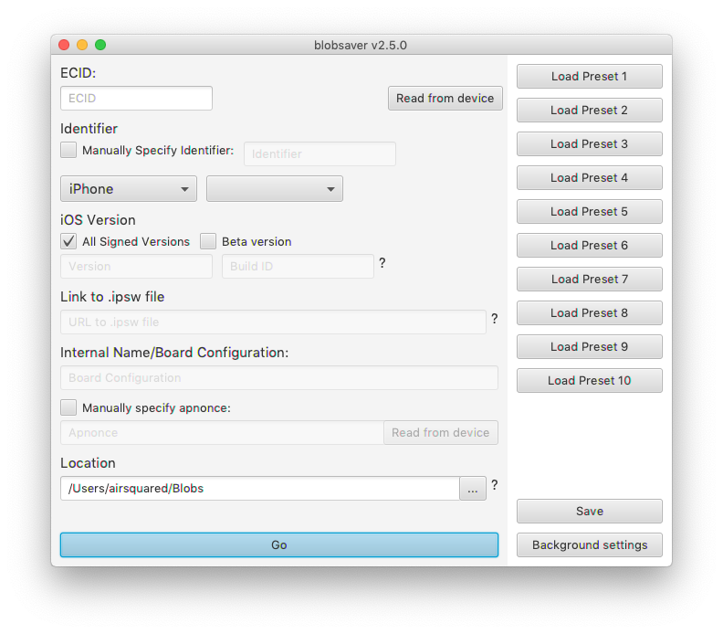
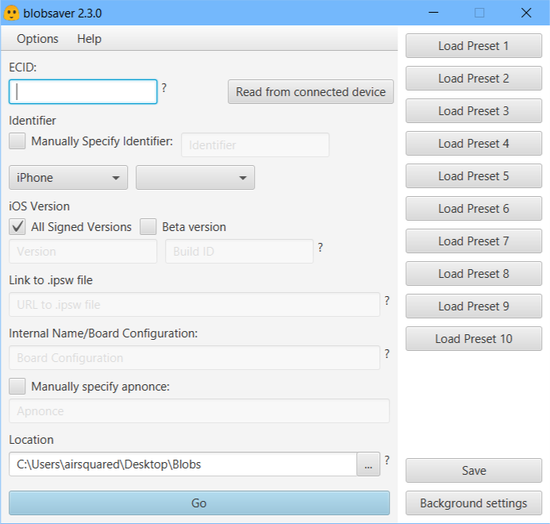

Help support this project by ⭐️'ing it! [Donations](https://www.paypal.me/airsqrd) also appreciated!

# blobsaver  
A GUI for saving SHSH blobs using [tsschecker](https://github.com/tihmstar/tsschecker). Supports Mac, Windows, and Linux. Requires [Java](https://java.com/inc/BrowserRedirect1.jsp).

**Tip:** if you want blobs you save to automatically be uploaded to the cloud, see [this](https://github.com/airsquared/blobsaver/wiki/Automatically-saving-blobs-to-the-cloud)

[Download here](https://github.com/airsquared/blobsaver/releases/latest)

If you have an antivirus or firewall, you may need to disable some other settings or disable the firewall completely for automatically saving blobs in the background to work. If you use Norton, go to Settings -> Firewall -> Advanced Program Control and set the option "Low Risk Applications" to "Allow".

## Features
- **Automatically save blobs in the background**
- Store up to ten devices with presets
- Save blobs for beta versions
- Read ECID and other info from device so you don't have to get it manually
- No need to download entire .ipsw for beta versions(just specify link)
- Choose where to save blobs with file picker
- Explains how to get ECID, Board Config(if needed), and information necessary for beta versions
- Automatically checks for updates and prompts if available
- Optionally specify device identifier instead of using device picker
- Optionally specify apnonce

## Feedback
Please send feedback via [Github Issue](https://github.com/airsquared/blobsaver/issues/new/choose) or [Reddit PM](https://www.reddit.com//message/compose?to=01110101_00101111&subject=Blobsaver+Feedback) if you encounter any bugs/problems or have a feature request. 

## Built With
- JDK 8
- [IntelliJ Idea](https://www.jetbrains.com/idea/)
- [Gradle](https://gradle.org/)
- [shadow](https://github.com/johnrengelman/shadow) (gradle plugin)
- [gradle-macappbundle](https://github.com/crotwell/gradle-macappbundle) (Mac) (gradle plugin)
- [gradle-launch4j](https://github.com/TheBoegl/gradle-launch4j) (Windows) (gradle plugin)
- [Inno Setup](http://www.jrsoftware.org/isinfo.php) (Windows) (for creating Windows installer)

See the full credits [here](src/main/resources/com/airsquared/blobsaver/libraries_used.txt).

## License 
This project is licensed under GNU GPL v3.0-only - see the [LICENSE](https://github.com/airsquared/blobsaver/blob/master/LICENSE) file for details
